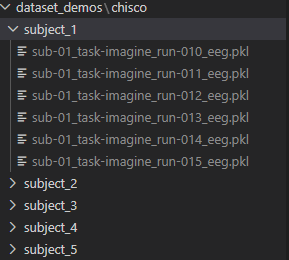

# Working Old Demo proof of concept

this repo is just to save the already working demonstration of the proposal, except this does not contain world modelling and the choices made were before the full research consolidation, which has now significantly changed my understanding 

for this demo to work, the chisco dataset needs to be set up in the following way:




the sub-01/02 (etc) names are the default names from the chisco dataset, hence depending on the subject's number, 
please ensure the folder name for each subject contains it, so that the `data_loading.py` file can easily load any amount of samples because it depends on the formatting; and depending on what subject numbers you are using you will need to modify the following:

```
#dataset params 
trial_num = 0 #out of 130
channels_for_brain_signals = 122 #exclude auxillary channels
subject_nums = [1, 2, 3, 5] #4 not included because it didn't have the same number of experiments 
experiments = [10, 11, 12, 13, 14, 15] #only using 6 experiments for demo
```

- Keep trial num and channels the same
- Subject nums are the 'x' in 'sub-0x...'
- experiment nums are the 'x' in 'run-0x..'